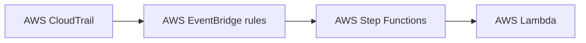

🔧 These are codes for three separate [AWS lambda](https://aws.amazon.com/pm/lambda/) functions.

The program flow is as follows:


We use a bottom-up approach to configure all the AWS services. In the next sections, the setup process has been described.

## 1️⃣ Permissions Required
These permissions can be set by creating appropriate [IAM roles](https://docs.aws.amazon.com/IAM/latest/UserGuide/id_roles.html) and associating them with the lambda function. We created three separate lambda functions for Amazon S3 deletion, AWS Elastic Beanstalk environment termination and dangling IP detection. We chose the environment runtime as **Node.js 20.x** and the instruction set architecture as **x86\_64**.
| AWS Components | Permissions |
|---|---|
| AWS Lambda: S3 | route53:*  
| | ses:*  
| | logs:CreateLogGroup  
| | logs:CreateLogStream  
| | logs:PutLogEvents  
| | s3:createBucket  
| | s3:Get*  
| | s3:List*  
| | s3:Describe*  
| | s3-object-lambda:Get*  
| | s3-object-lambda:List*  
| AWS Lambda: EBS | route53:*  
| | ses:*  
| | logs:CreateLogGroup  
| | logs:CreateLogStream  
| | logs:PutLogEvents  
| | AdministratorAccess-AWSElasticBeanstalk  
| AWS Lambda: IP | route53:*  
| | ses:*  
| | logs:CreateLogGroup  
| | logs:CreateLogStream  
| | logs:PutLogEvents  
| | ec2:AmazonEC2ReadOnlyAccess  

## 2️⃣ AWS Step function
Create a [Step function](https://aws.amazon.com/step-functions/) with a wait state of the desired wait time and associate it with the lambda function. (Not for dangling IPs)
```json
{
  "Comment": "desciption",
  "StartAt": "Wait",
  "States": {
    "Wait": {
      "Type": "Wait",
      "Seconds": {mention wait seconds here},
      "Next": "Lambda Invoke"
    },
    "Lambda Invoke": {
      "Type": "Task",
      "Resource": "arn:aws:states:::lambda:invoke",
      "OutputPath": "$.Payload",
      "Parameters": {
        "Payload.$": "$",
        "FunctionName": {mention lambda function arn here}
      },
      "Retry": [
        {
          "ErrorEquals": [
            "Lambda.ServiceException",
            "Lambda.AWSLambdaException",
            "Lambda.SdkClientException",
            "Lambda.TooManyRequestsException"
          ],
          "IntervalSeconds": 1,
          "MaxAttempts": 3,
          "BackoffRate": 2
        }
      ],
      "End": true
    }
  }
}
```


## 3️⃣ EventBridge rules
Create [EventBridge rules](https://docs.aws.amazon.com/eventbridge/latest/userguide/eb-rules.html) with the mentioned event and associate them with the appropriate step function (or lambda function in case of dangling IP)
- Amazon S3 bucket deletion event:
```JSON
{
  "source": ["aws.s3"],
  "detail-type": 
    ["AWS API Call via CloudTrail"],
  "detail": {
    "eventSource": ["s3.amazonaws.com"],
    "eventName": ["DeleteBucket"]
  }
}
```
- AWS Elastic Beanstalk environment deletion event:
```JSON
{
  "source": ["aws.elasticbeanstalk"],
  "detail-type": 
    ["AWS API Call via CloudTrail"],
  "detail": {
    "eventSource": 
      ["elasticbeanstalk.amazonaws.com"],
    "eventName": ["TerminateEnvironment"]
  }
}
```
- IP dangling event:
```JSON
{
  "source": ["aws.ec2"],
  "detail-type": ["EC2 Instance State-change Notification"],
  "detail": {
    "state": ["terminated", "stopped"]
  }
}
```
```JSON
{
  "source": ["aws.cloudtrail"],
  "detail-type": ["AWS API Call via CloudTrail"],
  "detail": {
    "eventSource": ["cloudtrail.amazonaws.com"],
    "eventName": ["ReleaseAddress"]
  }
}
```
```JSON
{
  "source": ["aws.cloudtrail"],
  "detail-type": ["AWS API Call via CloudTrail"],
  "detail": {
    "eventSource": ["cloudtrail.amazonaws.com"],
    "eventName": ["ModifyVpcEndpoint"]
  }
}
```
```JSON
{
  "source": ["aws.cloudtrail"],
  "detail-type": ["AWS API Call via CloudTrail"],
  "detail": {
    "eventSource": ["cloudtrail.amazonaws.com"],
    "eventName": ["AssociateAddress"]
  }
}
```


# Project Demo
https://github.com/user-attachments/assets/03e6c7c7-e1b9-4e6d-a49f-ef05ec9e8cf4


## 🔧 Other Configurations:
Please ensure that [AWS Cloudtrail](https://docs.aws.amazon.com/awscloudtrail/latest/userguide/cloudtrail-user-guide.html) is enabled and successfully captures logs.
